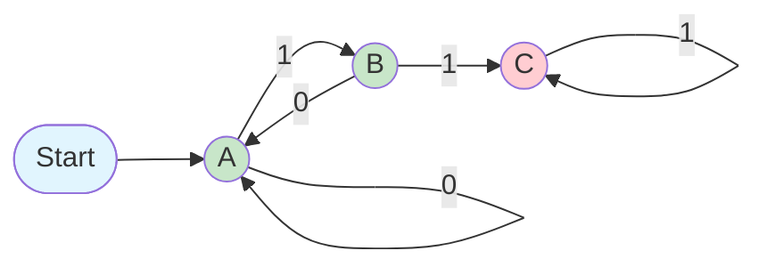

# 🤖 有限自动机（Finite Automata）学习笔记

> 这是一份根据课程课件整理的、适合小白学习的《有限自动机》Markdown语法笔记。

---

## 📚 什么是有限自动机（FA）？

### 💡 核心思想
一种用有限状态和转移规则来描述计算的抽象模型。

### 🎯 形象比喻
像一个简单的自动售货机或交通灯，状态数量有限，根据输入（投币/计时）按固定规则改变状态。

### 🎯 应用初衷
用于建模时序开关电路。如今，多种软件（如文本识别）都可用FA建模。

---

## 🔤 基本概念（行话）

### 2.1 字母表 (Alphabet, Σ)
一个有限的符号集合。

**例子:**
- **二进制**: Σ = {0, 1}
- **字母**: Σ = {a, b, c, ..., z}
- **操作键**: Σ = {↑, ↓, ←, →, A, B}

### 2.2 字符串 (String)
由字母表中符号组成的有限序列。

- **空串 (ε)**：不包含任何符号的特殊字符串，长度为0。

### 2.3 语言 (Language)
定义在某个字母表上，满足某种规则的所有字符串的集合。

**例子:**
- 所有以"ing"结尾的字符串
- 所有括号匹配的表达式（如 `()()`、`(())`）

---

## ⚙️ 确定性有限自动机 (DFA)

> **"确定性"**意味着在任何状态下，对任何输入符号，下一步的状态都是唯一确定的。

### 3.1 DFA的五大组成部分

一个DFA M 可以定义为 **M = (Q, Σ, δ, q₀, F)**：

| 符号 | 含义 | 说明 |
|------|------|------|
| **Q** | 有限的状态集合 | 所有可能的状态 |
| **Σ** | 输入字母表 | 允许的输入符号 |
| **δ** | 转移函数 | 规则手册，定义 δ(当前状态, 输入符号) = 下一个状态 |
| **q₀** | 起始状态 | q₀ ∈ Q |
| **F** | 接受状态集合 | F ⊆ Q，终止状态 |

### 3.2 表示方法：状态转移图

| 元素 | 表示方法 | 说明 |
|------|----------|------|
| 🔵 **圆圈** (节点) | 表示状态 | 每个状态用一个圆圈表示 |
| ➡️ **带箭头的线** (边) | 表示转移规则 | 状态间的转换 |
| 🏷️ **边上的标签** | 引起转移的输入符号 | 触发状态转换的输入 |
| 🚀 **起始状态** | 用"Start"箭头指向 | 开始执行的地方 |
| ✅ **接受状态** | 用双圈表示 | 成功结束的状态 |

### 3.3 示例：识别不含连续两个'1'的字符串

**任务**：设计DFA，接受如 `0`, `010`, `1010`；拒绝如 `11`, `110`。

#### 🎯 状态设计：
- **状态A** (起始&接受): 字符串合法，且最后一个字符不是'1'
- **状态B** (接受): 字符串合法，且最后一个字符是'1'（再读一个'1'就非法）
- **状态C** (拒绝): 已读到"11"，进入非法状态（陷阱）

#### 📊 状态转移图:


#### 🔍 验证字符串 "101":
1. **起始状态 A**
2. **读 1** → 根据 δ(A,1)=B 进入状态 B
3. **读 0** → 根据 δ(B,0)=A 进入状态 A  
4. **读 1** → 根据 δ(A,1)=B 进入状态 B
5. **输入结束**，状态 B ∈ F (是接受状态) → **✅ 接受**

---

## 💻 DFA的代码实现

DFA的逻辑清晰，易于编码实现（以Java为例，模拟上述DFA）：

```java
// 模拟DFA运行
String input = "101"; // 输入字符串
int state = 0; // 初始化状态: 0代表A, 1代表B, 2代表C

for (char c : input.toCharArray()) {
    switch (state) {
        case 0: // 状态A
            state = (c == '1') ? 1 : 0;
            break;
        case 1: // 状态B
            if (c == '0') state = 0;
            else if (c == '1') state = 2;
            break;
        case 2: // 状态C（陷阱）
            state = 2;
            break;
    }
}

// 检查最终状态
if (state == 0 || state == 1) { // 判断是否为接受状态A或B
    System.out.println("✅ 接受");
} else {
    System.out.println("❌ 拒绝");
}
```

---

## 🌐 正则语言 (Regular Languages)

### 📖 定义
如果一个语言 L 能被某个DFA接受，则称 L 是正则语言。

> ⚠️ **重要提示**：并非所有语言都是正则的！ DFA只有有限内存（状态），无法解决需要"无限计数"的问题。

### ✅ 正则语言例子：
- 所有包含子串"abc"的字符串
- 所有长度为偶数的二进制串

### ❌ 非正则语言例子：
- **L = {0ⁿ1ⁿ | n ≥ 1}** (要求0和1的数量相等，DFA无法记忆任意大的n)
- 所有括号完全匹配的字符串（需要记忆任意多未匹配的'('）

---

## 📋 总结

| 概念 | 说明 |
|------|------|
| 🤖 **有限自动机 (FA)** | 基于有限状态和转移规则的计算模型 |
| 🔤 **字母表 (Σ)** | 输入符号的有限集合 |
| 📝 **字符串** | 符号的有限序列（包括空串 ε） |
| 🌐 **语言** | 满足特定规则的字符串集合 |
| ⚙️ **DFA** | 确定性有限自动机，定义为一个五元组 (Q, Σ, δ, q₀, F) |
| 📊 **状态转移图** | 表示DFA的直观图形化方法 |
| ✅ **正则语言** | 能被某个DFA接受的语言 |

### 🔗 核心关系
**DFA** 是识别 **正则语言** 的一种机器模型。

---

<div align="center">

**🎓 学习有限自动机，掌握计算理论的基础！**

</div>